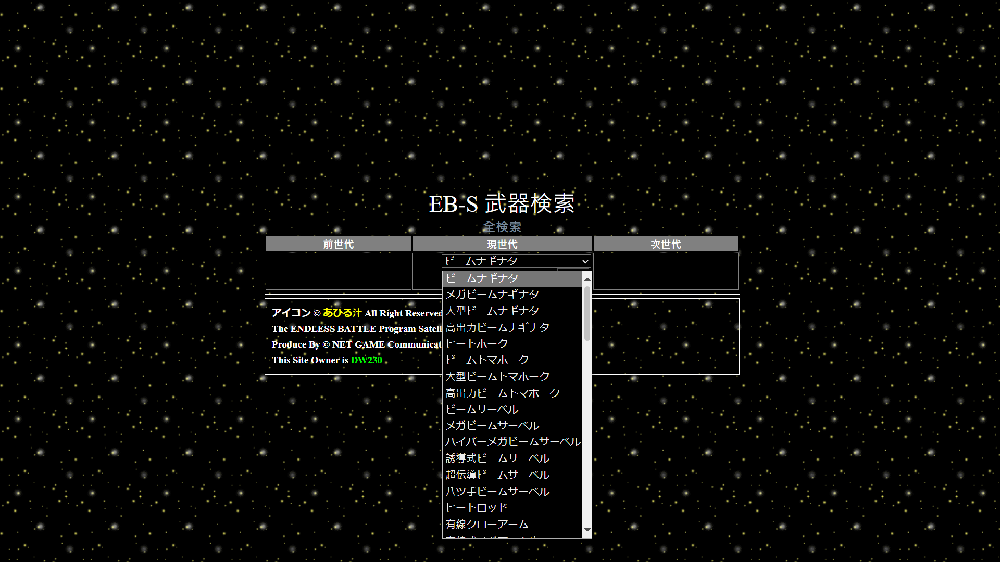
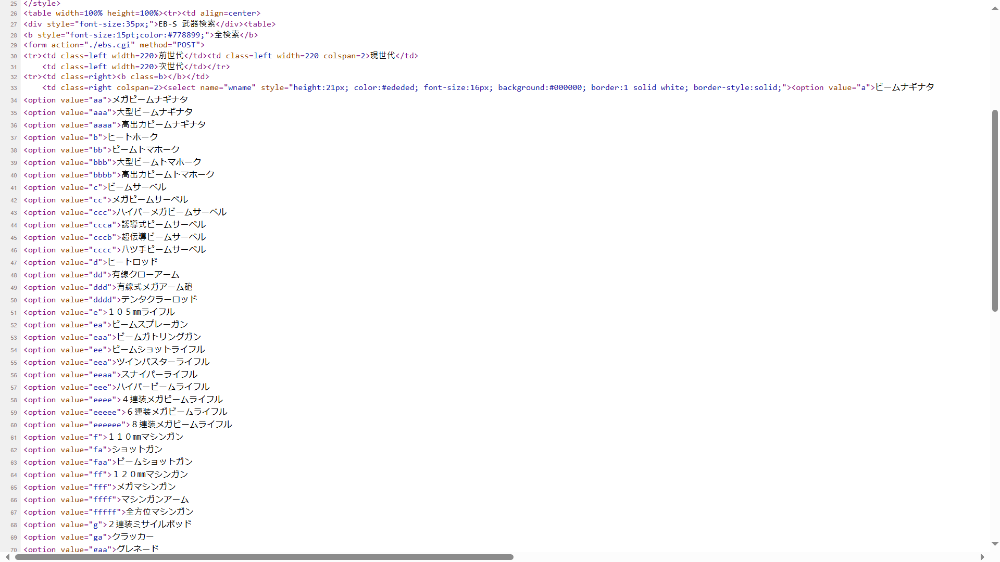
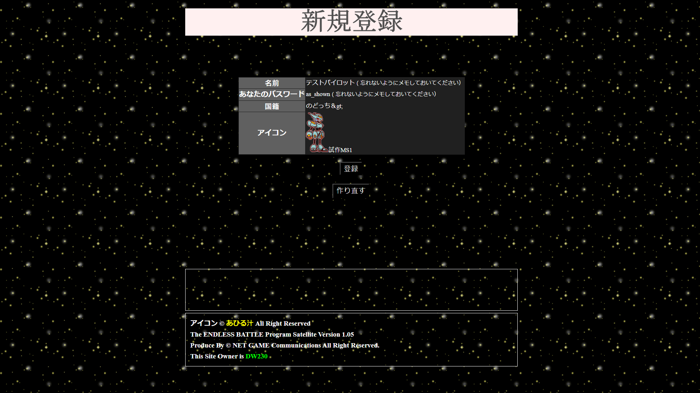

# PERN-EBS
As I just learned how to use PERN stack (PostgreSQL database, Express backend, React frontend, Node.js framework) to build a fully functional web application, I wish to try using this stack to revive a legacy web game: Endless Battle Satellite.

The newest known official version was built by ©NET GAME Communications in 2001 with Perl CGI

A newer version built with PHP was built by some Hongkonger/Taiwanese and posted on GitHub here: https://github.com/c0re100/PHP-Endless-Battle

He/She addressed that the PHP Endless Battle Satellite (PHP-EBS) was discontinued.

With spegatti code, that PHP-EBS is nearly impossible to maintain and debug.

PHP-EBS is also vulnerable to SQL Injection, which I have learned how to prevent.

PHP-EBS has incomplete server side form checking, which is also easier to deal with Express

PERN stack allows these to happen:
- Using JavaScript as the common programming language in front-end (React) and back-end (Express)
- Actually separate Model (database), View (front-end), Controller (back-end) into 3 logic components.
- Single Page Application (React), while need longer initial loading time, can react to user input faster.
- Data validation and sanitization using both React and Express, providing 2 layers of defense against injection attacks.
- A PostgreSQL database to store all information required.

# Weapon list in old EBS 1.05
Weapon list (ebs.cgi?WEAPON) contains information of most weapons in EBS.

And the source code looks like this

# Registering an account in old EBS 1.05 built by ©NET GAME Communications
Step 1

This step involves a post action, but the server side doesn't check the source of post.

The server side does check if your desired player name collides with anyone else in this step.

Step 2

Your password is directly shown on the screen.

This step involves a post action, again, the server side doesn't check the source of post.

# There are several vulnerabilities above, and my solutions
- 1: Weapon list
You can save the weapon list form action part to your computer, and change the form action URL as below

`<form action="https://www.endless-battle.net/ebs.cgi" method="POST">`

The weapon IDs also have easily recognizable patterns, allowing the search for secret weapon information with ease.

 - For example you can add one line in the list of option tags to look for fortress weapon:

`<option value="zzzz">Fortress`, open the web page, choose this and click 検索 (Search)

You got it, the name is "ビッグキャノン" (Big Cannon), you can now update the name too!

 - Another example, you see that `<option value="aaaa">高出力ビームナギナタ` has one secret next generation weapon, the weapon ID of the next one should be "aaaaa"

Insert `<option value="aaaaa">secret` below the above option tag, refresh your local web page and try again, you got the name of the secret weapon now.

Repeat the process above, you are almost having access to all weapons in the list.

Some EBS also uses the same path of the sample code for storing weapon information (/log/_hash.data), and allow all people to directly download the data.

This vulnerability can be directly solved by saving all the information in a database.

I don't know if secret weapon feature should be retained, but my sample version won't be including any.

- 2: Password length

Original version only allows maximum password length of 8.

For normal players, limiting password to maximum 8 characters means they can have difficulty to use a secure password.

My version will limit the minimum password length to 8.

Instead, the maximum password length will be 72, which is same as the BCrypt hashed passwords and secrets.

- 3: Character(Personality) and Weapon cheats

In both steps, you can cheat by saving the registration page to your computer, and do modification of your saved registration page as below:
  - Common: Modify `form action=./ebs.cgi` to `form action=https://www.endless-battle.net/ebs.cgi` (this is the exact EBS used for demonstration)
  - Cheat for step 1:

Between `<option value=5>冷酷` and `</select>` add ` <option value=6>覚醒`, this adds a new character type.

copy the whole list in ebs.cgi?WEAPON, from `<option value="a">ビームナギナタ` to `<option value="yb">短弓` to replace the original list of weapons that you can choose
  - Cheat for step 2:

Save the page to your computer, modify as below

Modify `<input type=hidden name=chara value=0>` to `<input type=hidden name=chara value=6>` for awaken character

Modify `<input type=hidden name=w value=i>` to `<input type=hidden name=w value=zzzz>` for Big Cannon (the fortress weapon)

Modify the part looks like `<input type=hidden name=pass value=as_shown>` with a long password for your own security, they don't check.
  - Potentional hacking (XSS, SQL injection) concern:

The back end does nothing for data validation and sanitization, which can cause vulnerabilities.

- 4: Extremely insecure way to directly show password to the player

If you are using a public computer to register, and it happens that one person behind you is looking at your screen with malicious intent, your account will be hijacked easily.

5: The server side does NOT check if your desired player name collides with anyone else in step 2

A malicious player can hijack and even delete someone's account with a crafted registration confirmation page without even knowing his/her password!

This is the biggest vulnerability in EBS 1.05, which will not happen in PERN-EBS

To prevent cheating, hacking and add features at the same time, PERN-EBS will divide creating an account and creating a pilot into 2 steps, which can:
- Prevent new players registering an account and get powerful and/or expensive items instantly
- Allow players to create multiple pilots from single account, for now 4 is the max limit
- Data validation and sanitization will be done to both prevent cheating and code injection.
- I would classify weapons furthermore, like weapons for Mobile Suits, Mobile Fighters, Battleships, and Fortress.

# Features different from the old EBS 1.05 built by ©NET GAME Communications
- Pilot has 6 kinds of attributes (inherited from Super Robot Wars series), instead of the 4 attributes (ATK, DEF, EVD, HIT) of the original EBS:
  - CQB: Close-Quarters Battle
  - RNG: Ranged Combat
  - SKL: Skill
  - DEF: Defense
  - EVD: Evasion
  - HIT: Accuracy

- Spirit command instead of strategy (inherited from Super Robot Wars series):

Your pilot can be equipped with at most 6 kinds of spirit commands at a time, depending on his/her level.

How those spirit commands are implemented will be determined later.

- Choose pilot type instead of character:

Your pilot was born as Natural, New Type, Coordinator, Innovade, Innovator, Accord

Natural pilots may be weaker at first, but you will have options to train the natural pilot to become a different kind.

Other kinds of pilots are naturally better, but they don't have many options.

Although in Gundam SEED Freedom, Accords are stronger than Coordinators, for the game balance I will set them to be almost the same.

- Team and Battleship

You can have a team with battleship, you don't directly control the battleship, but you can request support from battleship.

When you join a country, the high ranking officer has to assign you to a team if he/she decides to allow your admission.

You can still have join a team without joining a country.

- Others

I will update when I get some new ideas. The design phase of this project has not finished.

Feel free to give some suggestions.
