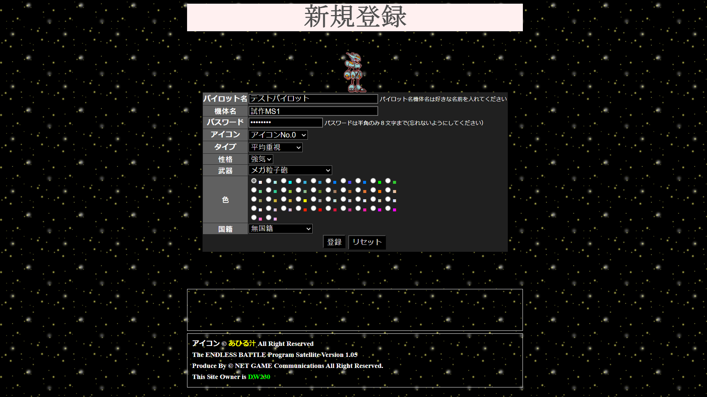

# PERN-EBS
I wish to try using PERN (PostgreSQL database, Express.js backend, React.js frontend, Node.js framework) stack to remaster a legacy web game: Endless Battle Satellite
The newest known official version was built by ©NET GAME Communications in 2001 with Perl CGI
A newer version built with PHP was built by some Hongkonger/Taiwanese and posted on GitHub here: https://github.com/c0re100/PHP-Endless-Battle
He/She addressed that the PHP Endless Battle Satellite (PHP-EBS) was discontinued.
With spegatti code, that PHP-EBS is nearly impossible to maintain and debug.
PHP-EBS is also vulnerable to SQL Injection, which I have learned how to prevent.
PHP-EBS has incomplete server side form checking, which is also easier to deal with Express.js

# Known vulnerabilities about the old EBS 1.05 built by ©NET GAME Communications and my solutions:
1: Maximum password length is 8, which makes a password very insecure.
My version will limit the minimum password length to 8, instead, the maximum password length will be 72, which is same as the BCrypt hashed passwords and secrets.

2: Registration vulnerabilities
The original version has 2 steps of the registration
- Step 1

- Step 2

3: Registration cheat
The registration process was 2 step: yo
You could just modify some information in the form, like the weapon ID to create an account with a robot equipped with powerful weapon, or a weapon that costs a lot of money for sale.
PERN-EBS divides creating an account and creating a pilot into 2 steps, which can:
- Prevent new players from getting items that is not supposed for new players
- Allow players to create multiple pilots from single account, for now I would limit the number to 4
- Allow the implementation of combo attacks (like Jet Stream Attack)

# Features different from the old EBS 1.05 built by ©NET GAME Communications
1: Weapon:
- can be installed on different part of the robot.
